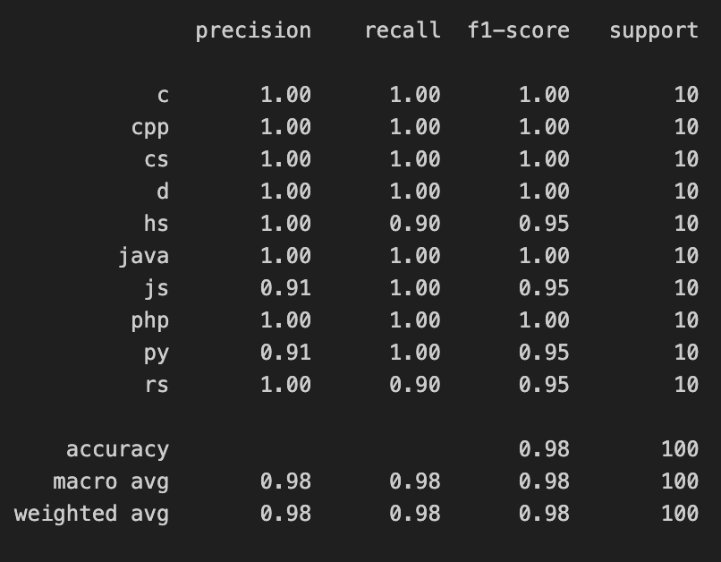

# 🧠 Code Language Classifier with BiLSTM + Attention

This project builds a deep learning classifier that predicts the programming language of code snippets using a custom neural network architecture. It leverages a bidirectional LSTM with attention to capture language-specific patterns and structure in code.

## 📂 Dataset

- Source: [IBM Project CodeNet](https://developer.ibm.com/exchanges/data/all/project-codenet/)
- Contains source code files in 10 different programming languages
- Each file is labeled by its language and processed into token sequences

## 🧱 Architecture

- Embedding layer to map tokens to dense vectors
- Bi-directional LSTM to capture forward & backward context
- Attention mechanism to weigh important tokens
- Dense output layer with Softmax activation

Built using **PyTorch**, trained on a balanced dataset of code samples.

## 🧹 Preprocessing

- Line-by-line file reading, preserving syntax structure
- Tokenization at word/symbol level
- Label encoding + padding of sequences
- Conversion to PyTorch tensors
- Train/validation split

## 📈 Results

- 7 out of 10 languages classified with **F1 = 1.00**
- Small confusions among syntactically similar languages (e.g. Python vs JavaScript)
- Model shows strong robustness across diverse syntax styles



## 🚀 How to Run

```bash
# Clone this repo
git clone https://github.com/OliverRiemann/code-language-classifier-nlp.git
cd code-language-classifier-nlp

# Install dependencies
pip install -r requirements.txt

# Open and run the notebook
jupyter notebook code_language_classifier.ipynb
